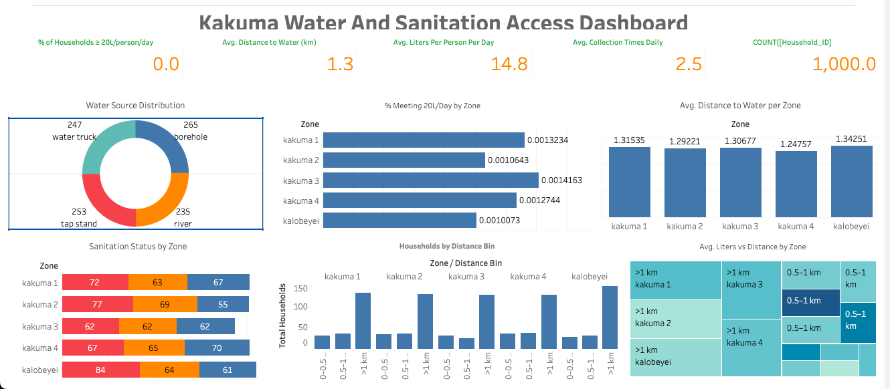

# Kakuma-and-Kalobeyei-Water-Access-Project-Dashboard

💧 Water Access and Sanitation Conditions in Kakuma

## 📘 Project Overview

This project presents a comprehensive data-driven analysis of water access and sanitation conditions in the **Kakuma refugee camp**, one of the largest refugee settlements in the world.

Using **Python** for data preprocessing and **Tableau** for visualization, the analysis focuses on key humanitarian indicators including:

- 🚶‍♀️ **Average distance to water sources**
- 💧 **Liters of water per person per day**
- 📊 **Water sufficiency vs. Sphere standard (20L/person/day)**
- 🚽 **Sanitation status by zone**

---

## 🔍 Key Findings

- Only **0% of households** meet the international minimum water standard (20L/person/day).
- Zones **Kalobeyei, Kakuma 1, and Kakuma 2** have the **longest distances** to water sources and **poorest sanitation conditions**.
- A **positive correlation** was observed between water access and sanitation outcomes.
- **Boreholes** were the most used source, though often unreliable in quality.

---

## 📊 Dashboard Insights

The interactive Tableau dashboard includes:

### Page 1: **Water Access Overview**
- KPIs for distance, liters, and source type
- Bar and pie charts showing water distribution by zone

### Page 2: **Water Sufficiency & Sanitation**
- % of households meeting the 20L standard
- Sanitation scores by zone
- Interactive filters for targeted exploration

---

## 📸 Dashboard Preview

*Above: Tableau dashboard showing key water access and sanitation indicators across Kakuma and Kalobeyei zones.*

---

## 🛠️ Recommendations

- Expand boreholes and piped systems in **Kalobeyei, Kakuma 1, and Kakuma 2**
- Promote **latrine construction and hygiene education**
- Use dashboards for **data-driven decision-making**

---

## 🧰 Tools Used

- **Python** (Pandas, Matplotlib)
- **Tableau** (Interactive dashboard creation)
- **PowerPoint** (Final presentation)

---

## 📌 Author

> A data analytics capstone project focused on humanitarian insights and visual storytelling.
